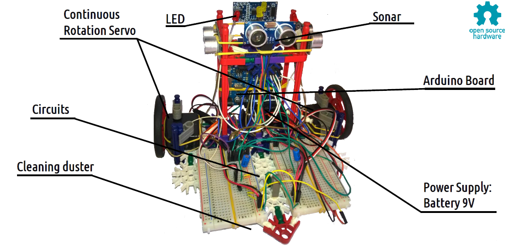

# Explorino
Arduino based robot to autonomously explore and map indoor rooms.

## What is Explorino?
  Explorino (**Explor**e + Ardu**ino**) is an open-source autonomous robot for the exploration, mapping and cleaning of indoor rooms. 
  
  
  Inspired by commercial robots on the market (eg. Roomba), we want to make a cheap and versatile robot for mapping and cleaning indoor spaces. We welcome all Arduino and robotics enthusiasts willing to help and partecipate!

### What does Explorino do?
  1. Exploration: Explorino sees its surrounding in-plane area, detect obstacles and free paths. 
  2. Mapping: Explorino memorises the taken path while acquiring the room map, inspired by [Trémaux's](https://en.wikipedia.org/wiki/Maze_solving_algorithm#Tr%C3%A9maux's_algorithm) maze solving algorithm.
  3. Cleaning: Explorino cleans all of the available units on the map.
  
 ### What is Explorino made of?
It is currenlty based on Arduino Uno. To achieve the aforementioned tasks, it uses:
  1. Sonars to detect obstacles, 2 servo-motors to move while counting the type and number of taken steps 
  2. 1 Arduino Uno to control servos and save map into a matrix
  3. A microfiber cloth for cleaning
  
Here some gif of Explorino avoiding obstacles and cleaning:  
  

 Detailed list of Explorino 1.0 components in: 1.0/components.md.  
 The current setup has some intrinsic limitations:
 1. Servos rotations and steps get shorter over time as battery runs out
 2. Arduino internal memory is quite small, there is a compromise on saved map size and accuracy  
 3. The microfiber cloth is not reausable 

 To address these limitations and add new features, we have some ideas for the future.
 
### What will Explorino feature in the future?
  [ ] 3D printed modular case: compatible with interchangable and additional components, such as:
      - microfiber / fan / wet cleaning systems
      - camera module
      - wireless charger
  [ ] 3D printed cleaning system 
  [ ] Wireless charger
  [ ] Wireless (Wifi or Bluetooth) comunication system / larger internal memory
  [ ] Website to check the progression of cleaning / keep the room under suerveillance

 Current limitations and some ideas for future development in: milestones.md.

### Would you like to partecipate?
Today we are looking for other open-source enthusiasts to contribute to the project. 
In particular, we need:
* designers for the 3D-printed modular case and cleaning system 
* coders to improve our deterministic algorithm

Anyway, we welcome anyone who want to contribute with ideas, algorithm/coding, hardware prototypes, moral support or advertising
:smile:

### What is the origin of Explorino?
Explorino was born in 2016 as a small side-project from two students of Politecnico di Milano, Andrea T. and Giorgio M. 
Curious about autonomous mapping robot and tired of cleaning their room, they realized the first prototype of Explorino.

